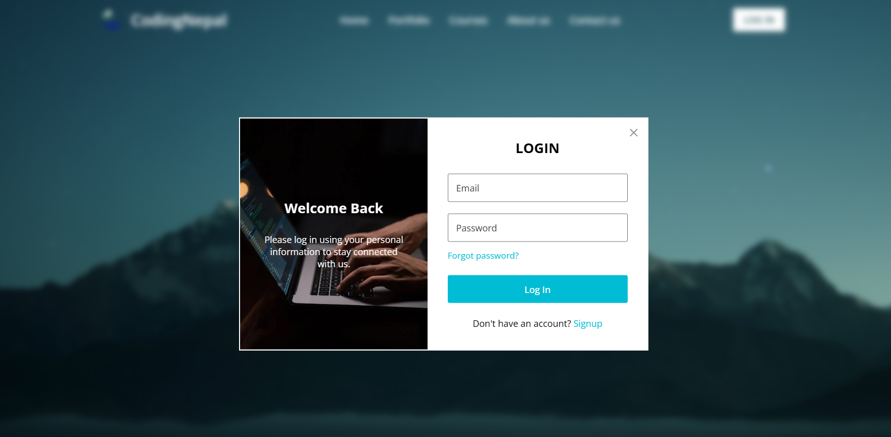

Features Added:

1.Password Visibility Toggle: Users can click the eye icon to show or hide their password.

2.Dark Mode Support: Users can switch between light and dark themes with a single click. All form inputs and text adapt to dark mode.

3.Password Strength Indicator: Signup form displays the password strength (Weak, Medium, Strong) dynamically as the user types.