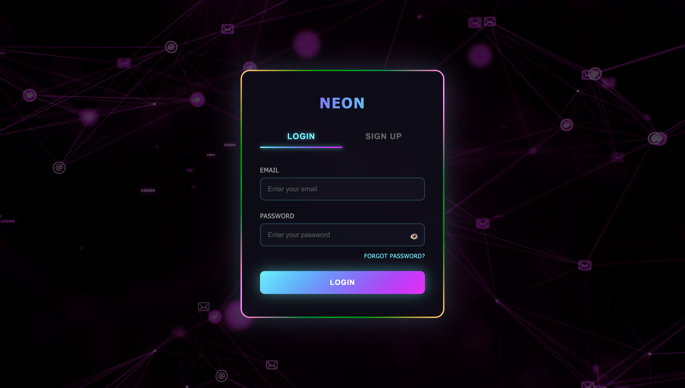

# 🌟 Neon Login/Signup Page - Hacktoberfest Contribution

## 📋 Overview
This pull request adds a modern, visually stunning neon-themed login and signup page with video background integration to the project.

## ✨ Features Added

### 🎨 Design & UI
- **Neon Aesthetic**: Vibrant neon glow effects with cyan/magenta color scheme
- **Video Background**: Dynamic video background with overlay for enhanced visual appeal
- **Responsive Design**: Fully responsive layout that works on all device sizes
- **Tab Navigation**: Smooth tab switching between Login and Sign Up forms
- **Animated Transitions**: Smooth animations for tab switching and form interactions

### 🔐 Functionality
- **Login Form**: Email and password input with validation
- **Sign Up Form**: Email, password, and confirm password fields with terms acceptance
- **Password Toggle**: Eye icon to show/hide password for better UX
- **Form Validation**: Required field validation for all inputs
- **Forgot Password**: Quick access link for password recovery

### 🎯 Technical Highlights
- Clean, semantic HTML5 structure
- Modern CSS with custom properties (CSS variables)
- Vanilla JavaScript for interactivity (no dependencies)
- Cross-browser compatible
- Accessible form elements with proper labels

## 📁 Files Included
- `index.html` - Main HTML structure
- `style.css` - Complete styling with neon effects (referenced)
- `main.js` - JavaScript functionality (referenced)

## 🎨 Screenshot
> Add screenshots of the login/signup page here

## 🤝 Contribution Guidelines
This contribution follows the project's coding standards and best practices:
- Clean, readable code with comments
- Semantic HTML structure
- Modular CSS organization
- Vanilla JavaScript (no framework dependencies)
- Mobile-first responsive design

## 🎃 Hacktoberfest
Coded with love ❤️ for **Hacktoberfest 2025**. 🎉
