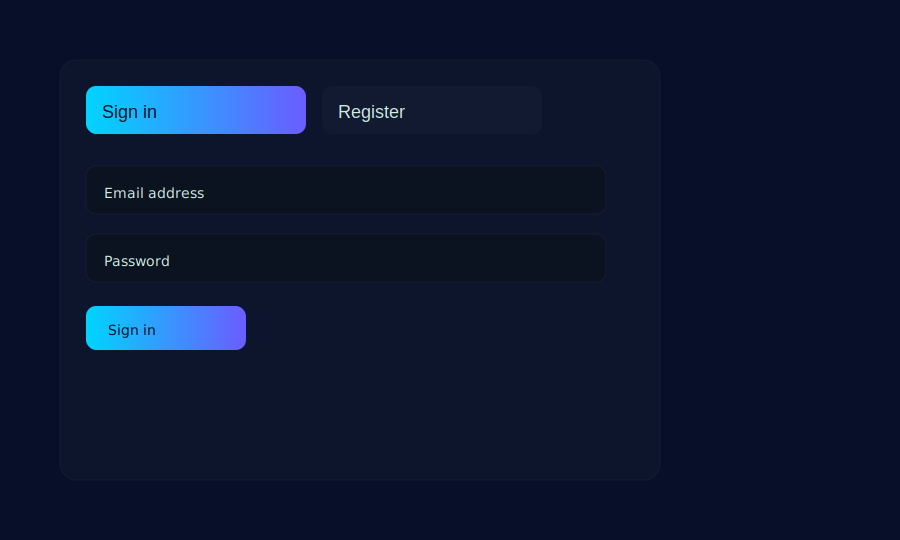

Auth Portal — Tech Login / Signup Template

Overview
--------
This is a modern, animated login / signup template meant as a visual front-end demo. It uses a canvas particle background, a segmented control with a springy circular knob and a circular reveal when switching between "Sign in" and "Register" forms. Both password fields include a live-strength meter (bars) and a textual strength label (Weak / Fair / Good / Strong).

Screenshot
----------

Files
-----
- `index.html` — main demo page with markup for both sign-in and register flows.
- `style.css` — styling: glass/techno theme, segmented control, reveal and meter styles.
- `script.js` — behavior: particle background, segmented knob + reveal animation, password meters and labels, demo success flow.
- `screenshot.svg` — a small screenshot placeholder used in this README.

How to preview
--------------
1. Open `index.html` in any modern browser (Chrome, Firefox, Edge, Safari).
2. Click the segmented control to switch between Sign in and Register — observe the springy knob and circular reveal.
3. Type in the password fields to see the bar meter and strength label update live.

Notes & customization
---------------------
- The current implementation is static (forms show a demo "success" animation). To integrate with a backend replace the form submit handlers in `script.js`.
- The particle background can be disabled or tuned in `script.js` for better performance on low-end devices.
- The knob spring effect is driven by a CSS keyframe re-triggered in JS. If you prefer even more natural physics I can integrate a small spring library to simulate real-world motion.

