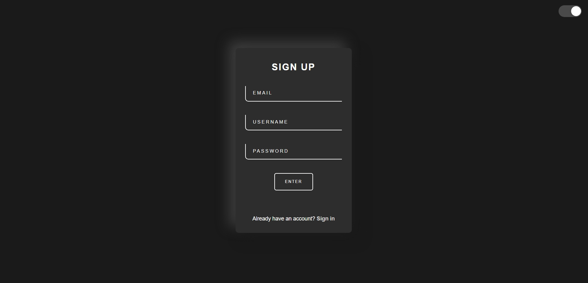

# Modern Sign Up Template

A clean and modern sign-up template with dark mode support, built using HTML, CSS, and JavaScript.

## Features

- 🌓 Dark/Light mode toggle
- 📱 Responsive design
- ✨ Modern neumorphic design
- 🎨 Smooth transitions and animations
- 📝 Input validation
- 🔄 Sign-in page link

## Screenshots

## How to Use

1. Clone the repository
2. Open `index.html` in your web browser
3. The template is ready to use!

## Technologies Used

- HTML5
- CSS3
- JavaScript

## Customization

You can customize the template by:

- Modifying colors in the CSS variables
- Adjusting the card dimensions
- Changing the input field styles
- Customizing the animations and transitions

## Contributing

Feel free to contribute to this template by:
1. Forking the project
2. Creating your feature branch
3. Committing your changes
4. Pushing to the branch
5. Opening a Pull Request

## License

This project is licensed under the MIT License - see the LICENSE file for details