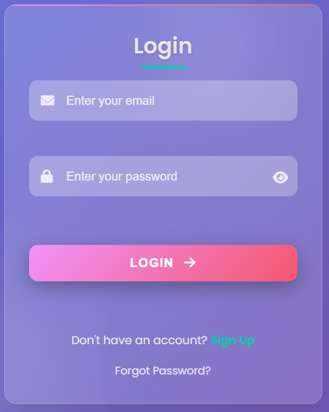
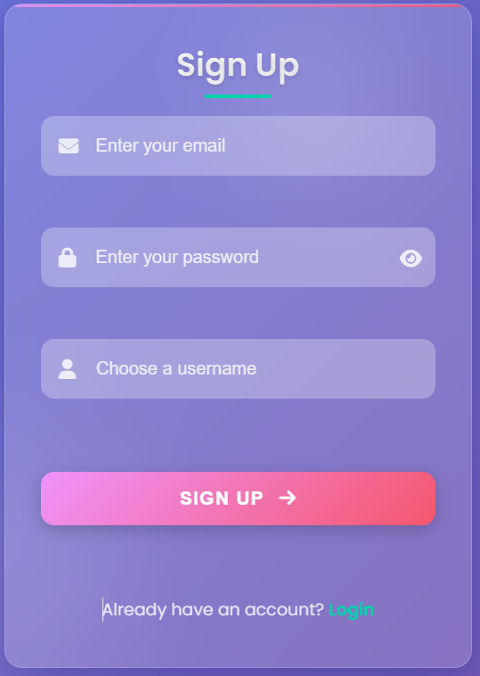

# 🌐 Glassmorphism Login-Signup Template  

A modern **Login & Signup page** built with **HTML, CSS, and JavaScript** using a stylish **glassmorphism design**.  
This template is **responsive, user-friendly, and easy to integrate** into any project.  

---

## ✨ Features  
- 🎨 **Glassmorphism UI** with blur and transparency effects.  
- 📱 **Responsive** design for desktop, tablet, and mobile.  
- 🔄 **Toggle** between Login and Signup in a single page.  
- ⚡ Smooth button hover animations.  
- 🛠️ Easy to customize and integrate.  

---

## 🚀 How to Use  
1. Clone this repository or copy the code into your project.  
2. Open the `index.html` file in your browser.  
3. Customize the design, branding, or logic as per your project needs.  

---

## 📷 Screenshot  
  
  
---

## 📂 File Structure  

```
samim29/
├── 📄 index.html          # Main HTML file with complete login/signup form
├── 📖 Readme.md           # Project documentation and usage guide
└── 📷 screenshot.png      # (Optional) Preview image of the template
```

### 📄 **File Details**

**`index.html`** - *Complete Template File*
- **HTML Structure**: Semantic markup with accessibility features
- **CSS Styling**: Embedded glassmorphism design with modern animations
- **JavaScript Logic**: Form validation, toggle functionality, and user interactions
- **Features Included**:
  - 🎨 Glassmorphism UI with backdrop blur effects
  - 📱 Fully responsive design (320px to desktop)
  - 🔐 Password visibility toggle with eye icon
  - ✅ Real-time form validation with error messages
  - 🎯 Smooth animations and hover effects
  - ♿ Accessibility features (ARIA labels, keyboard navigation)
  - 🌙 Support for reduced motion and high contrast modes

**`Readme.md`** - *Documentation File*
- Project overview and features
- Installation and usage instructions
- File structure explanation
- Contributing guidelines and license information

---

## 📝 License  
This template is open-source and available under the [MIT License](../../LICENSE).  

---

## 🙌 Contribution  
If you’d like to improve this template (animations, validation, new design tweaks), feel free to fork and open a pull request! 🚀  
